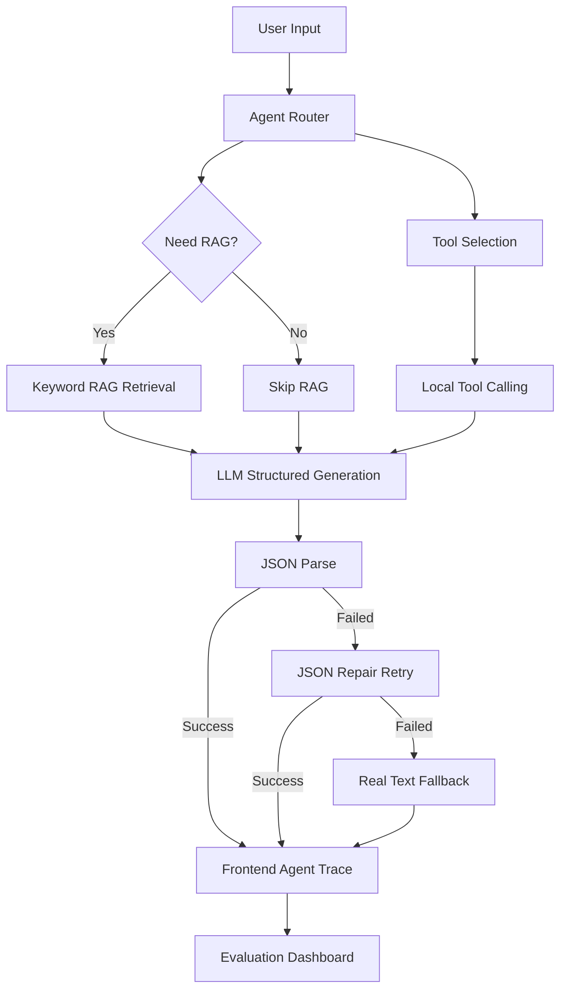

# Enterprise Agent Hub

企业知识库与业务流程自动化 Agent 平台

Enterprise Agent Hub is an interview-ready AI application project that demonstrates how to build an enterprise Agent platform with RAG, Agent Router, Tool Calling, OpenAI-compatible API integration, structured JSON output, fallback handling, and an evaluation dashboard.

> Current status: V1.3 includes Hybrid RAG retrieval, AI engineering routing, local knowledge import, and an Evaluation Dashboard with 74 built-in cases, browser-local history, trend summary, and Markdown / JSON report export. The project uses local mock/default data by default and can optionally call a real OpenAI-compatible model such as DeepSeek from server-side API routes.

## Project Positioning

Enterprise Agent Hub is a lightweight enterprise AI application platform based on:

- RAG knowledge retrieval
- Agent Router
- Tool Calling
- OpenAI-compatible API
- JSON structured output
- JSON repair and fallback
- Agent Evaluation Dashboard

The goal is to show the engineering loop of an AI application, not only a single model call.

## Core Features

- Knowledge Packs: built-in read-only packs for IT/admin, ecommerce support, recruitment matching, and AI engineering
- Pack-aware keyword RAG with title/category/tag/pack weighting
- Expanded Agent Evaluation Suite with quick / standard / full modes and V1.1 demo scenarios
- Multi-scenario Agent workspace
- Enterprise knowledge base Q&A
- E-commerce customer support and after-sales handling
- Recruitment and JD matching Agent
- RAG retrieval with source citations
- Rule-based Agent Router
- Local Tool Calling orchestration
- DeepSeek / OpenAI-compatible Real API mode
- Mock / Real dual mode
- JSON structured output
- JSON parse, repair, and text fallback
- LLM connectivity diagnostics with optional proxy support
- Agent Evaluation Dashboard with pass rate, routing accuracy, tool hit rate, citation rate, and fallback rate

## Tech Stack

- Next.js App Router
- TypeScript
- Tailwind CSS
- OpenAI-compatible Chat Completions API
- DeepSeek-compatible configuration
- undici ProxyAgent for optional server-side proxy support
- Local mock data
- Vercel-ready deployment shape

## Architecture



## Pages

- `/` - Project overview and core capabilities
- `/chat` - Agent workspace with Mock / Real API mode, Router, RAG, Tools, LLM step, and structured output
- `/knowledge` - Hybrid knowledge library with default packs, local paste/file import, generated chunks, and source citations
- `/tools` - Tool center with runnable local tool examples
- `/scenarios` - Scenario templates aligned with Agent Router intents and tools
- `/evaluation` - Agent Evaluation Dashboard for batch evaluation and failure analysis
- `/about` - Project showcase, architecture, version roadmap, metrics, and resume highlights

## Screenshots / 项目截图

Screenshots are intentionally not embedded yet, so the README does not contain broken image links before release assets are captured.

Recommended screenshots:

- Chat Agent Pipeline: show Router, RAG, Tools, LLM step, structured output, and Real API response.
- Knowledge Base: show read-only default documents, imported local documents, chunks, keywords, source types, and citations.
- Tool Center: show runnable tool cards and formatted JSON results.
- Evaluation Dashboard: show 74-case mock evaluation results, metrics, failure analysis, local history, trend summary, and report export actions.

Suggested capture plan is documented in `docs/screenshots.md`. When images are ready, place them under `public/screenshots/`.

## Local Development

```bash
npm install
npm run dev
```

Open `http://localhost:3000`.

## Environment Variables

Mock mode does not require an API key. Real API mode reads environment variables only from server-side API routes.

Create `.env.local` locally based on `.env.example`:

```env
AI_API_KEY=your_api_key_here
AI_BASE_URL=https://api.deepseek.com
AI_MODEL=deepseek-v4-flash
AI_PROVIDER=deepseek

HTTPS_PROXY=
HTTP_PROXY=
ALL_PROXY=
AI_REQUEST_TIMEOUT_MS=20000
```

Do not commit `.env.local`.

## Mock / Real Mode

- Mock mode: no API key required, deterministic local rules and mock data.
- Real mode: calls OpenAI-compatible Chat Completions through `src/app/api/agent/route.ts`.
- API keys are never exposed in browser-side code.
- If the model response is not valid JSON, the system tries one JSON repair call.
- If repair still fails, the UI uses the real text response and fallback structured output.
- If network, HTTP, or config fails, the system falls back to mock-agent output.

## Evaluation Results

Current V1.1 Mock full-suite evaluation target:

- total: 58
- passed: 50
- passRate: 100%
- scenarioAccuracy: 100%
- intentAccuracy: 100%
- toolHitRate: 100%
- ragUsageAccuracy: 100%
- citationRate: 100%
- keywordHitRate: 100%

The evaluation dashboard also reports failure buckets such as scenario mismatch, intent mismatch, tool mismatch, RAG usage mismatch, keyword miss, citation miss, and pipeline error.

## Security Notes

- `.env.local` is ignored and must not be committed.
- API keys are read only on the server.
- Browser pages only display masked key diagnostics.
- Proxy variables are intended for local development and should be configured in the runtime environment when needed.
- Mock data is synthetic and does not contain real enterprise or personal data.

## Vercel Deployment

This project is ready for Vercel-style deployment:

1. Push the repository after review.
2. Import the project in Vercel.
3. Configure environment variables in Vercel Project Settings.
4. Run the default build command: `npm run build`.
5. Keep Mock mode available for demos even when Real API credentials are not configured.

## Current Limitations

- RAG is currently pack-aware keyword-based mock retrieval, not vector search.
- Tool Calling is local tool orchestration, not model-native `tool_calls`.
- Data is local mock data, not a real database.
- Uploaded files, permissions, audit logs, and server-side evaluation history are planned future work.

## Roadmap

- Real file upload and document parsing
- Embeddings and vector database integration
- pgvector / Qdrant support
- Rerank and citation quality scoring
- Real model-native Tool Calls
- Database-backed evaluation history and trend charts
- User permissions and audit logs
- Production observability and tracing
## V1.1 Knowledge Management Experience

V1.1 keeps all content self-generated to avoid copying third-party material into the repository. It adds four built-in read-only knowledge categories that participate in RAG immediately:

- Enterprise IT / Admin: laptop requests, VPN, account permissions, reimbursement, leave, onboarding equipment, software licenses, and data security.
- Ecommerce Support: seven-day returns, quality issues, wrong shipment, coupons, membership benefits, logistics exceptions, refund timing, and escalation.
- Recruitment Matching: AI product manager, AI application developer, candidate scoring, interviews, resume screening, project matching, and follow-up scripts.
- AI Engineering: API key safety, RAG citations, fallback, JSON output, Agent Router, Tool Calling, evaluation datasets, and deployment checks.

Source types are shown in the UI as default knowledge, user upload, or user paste. Retrieved chunks include scoreReason so the product can explain why a source matched: keyword hits, title/category/tag hits, pack preference, and user document boost.

Manual V1.1 acceptance checklist:

- Confirm /knowledge shows read-only default categories without import buttons.
- Import a user document by paste or file upload and verify localStorage persistence.
- Ask a question that hits both default and user content, then inspect Top sources and score reasons.
- Run /api/evaluation in Mock mode and verify the suite remains stable.

## V1.2 Hybrid Retrieval Notes

V1.2 upgrades the mock keyword RAG into a more explainable Hybrid Retrieval layer. It is still not embedding or vector search. The retriever now normalizes the query, expands business synonyms, and scores chunks with keyword, title, tag, category, pack, source, phrase, and freshness signals.

Each retrieved chunk can expose scoreBreakdown, scoreReason, retrievalConfidence, lowConfidenceRetrieval, and query expansion terms. This makes the chat answer more trustworthy: if retrieval confidence is low, the Agent should say that the knowledge base evidence is insufficient instead of pretending that weak chunks are authoritative.

V1.2.1 further improves AI engineering routing. Questions about JSON repair, invalid structured output, fallback, Tool Calling failures, Agent evaluation datasets, Prompt constraints, RAG retrieval quality, Embedding, vector search, and source citations are routed to the AI Engineering scenario first and prioritize the `ai-engineering` knowledge pack. In the chat UI this appears as `AI Engineering / Knowledge QA` in product-facing labels, while raw enum values remain available only in debug JSON.

Future V1.4+ work can replace this local scoring with Embedding + Vector DB + Rerank while keeping the same UI explainability contract.


## V1.3 Evaluation History and Export

V1.3 turns the Evaluation Dashboard into a lightweight evaluation management view. After a run, users can save the result to browser localStorage, compare recent pass rates, keep the latest 20 runs, and export Markdown or JSON reports for project review, README screenshots, and interview discussion.

This is browser-local persistence, not a backend database. Future work can move evaluation history to a database, add team-level history, and render trend charts over time.
