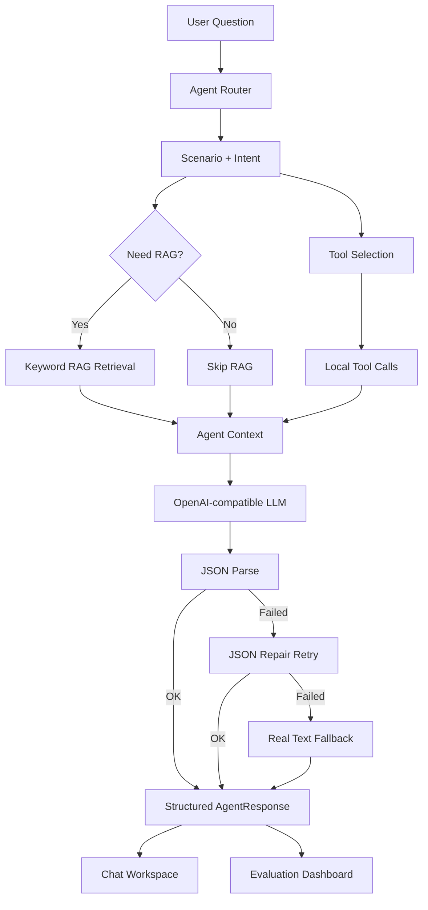

# Architecture

Enterprise Agent Hub is designed as a small but complete AI application architecture for interview demonstration. It keeps the core AI workflow visible: route, retrieve, call tools, generate structured output, handle fallback, and evaluate quality.

## High-Level Flow

## RAG Flow

Current RAG is intentionally lightweight:

1. Load mock knowledge documents.
2. Split documents into chunks.
3. Extract simple keywords.
4. Score chunks by keyword overlap, title hits, and category hits.
5. Return TopK chunks.
6. Build source citations from retrieved chunks.
7. Generate a mock answer.

This is not a real vector database yet. It is designed to make the RAG chain visible before upgrading to embeddings, vector search, rerank, and real LLM answer generation.

## Agent Router Flow

The router is rule-based in the current version:

1. Read user question.
2. Match scenario keywords.
3. Infer scenario: enterprise, ecommerce, recruitment, or general.
4. Infer intent: knowledge QA, policy check, order query, product query, after-sale reply, JD match, ticket creation, or general chat.
5. Decide whether RAG is needed.
6. Select tools for the route.

The router is kept deterministic so it can be evaluated without paying for model calls.

## Tool Calling Flow

Tool Calling is local orchestration in V0.7:

- `queryOrder`
- `queryProduct`
- `searchPolicy`
- `createTicket`
- `analyzeJD`
- `generateCustomerReply`

The model does not currently perform native `tool_calls`. The server-side Agent pipeline selects and executes local tools based on Router output. This keeps the workflow inspectable and safe for demos.

## Real API Flow

Real API mode uses server-side API routes only:

1. Frontend sends question and mode to `/api/agent`.
2. Server runs mock Agent pipeline first.
3. Server builds LLM messages from Router, RAG, and tool results.
4. Server calls OpenAI-compatible Chat Completions.
5. Server parses structured JSON.
6. Server returns final answer, structured output, trace steps, and diagnostics.

API keys are never exposed in browser code.

## Fallback Flow

Fallback is part of the engineering design:

- Missing API key: return mock-agent result.
- Network or HTTP error: return mock-agent result.
- Invalid JSON: try one repair request.
- Repair success: `responseMode=real_repaired`.
- Repair failure with real text: `responseMode=real_text_fallback`.
- Full failure: `responseMode=fallback`.

This lets the demo remain usable even when the model or network is unstable.