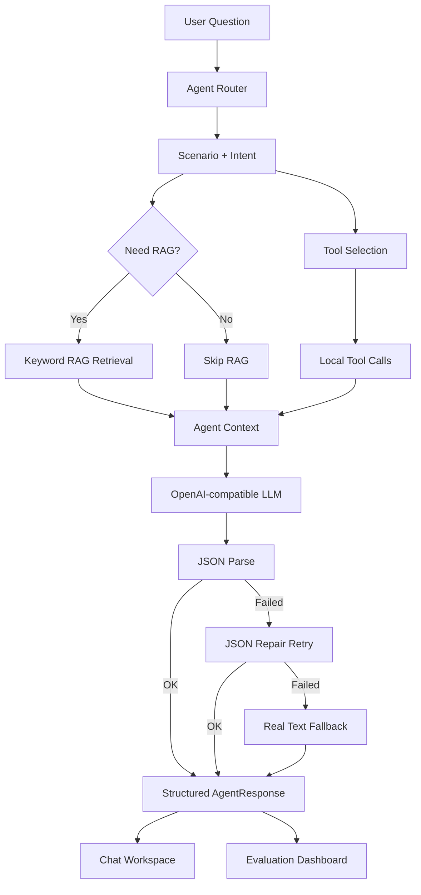

# Architecture

Enterprise Agent Hub is designed as a small but complete enterprise AI Agent application architecture. It keeps the core AI workflow visible: route, retrieve, call tools, generate structured output, handle fallback, collect feedback, and evaluate quality.

## High-Level Flow

## RAG Flow

Current RAG is intentionally lightweight:

1. Load default Knowledge Packs and optional user-imported local documents.
2. Split documents into chunks.
3. Extract simple keywords.
4. Score chunks by keyword overlap, title hits, and category hits.
5. Return TopK chunks.
6. Build source citations from retrieved chunks.
7. Generate a mock answer.

This is not a real vector database yet. It is designed to make the RAG chain visible before upgrading to embeddings, vector search, rerank, and real LLM answer generation.

## Agent Router Flow

The router is rule-based in the current version:

1. Read user question.
2. Match scenario keywords.
3. Infer scenario: enterprise, ecommerce, recruitment, or general.
4. Infer intent: knowledge QA, policy check, order query, product query, after-sale reply, JD match, ticket creation, or general chat.
5. Decide whether RAG is needed.
6. Select tools for the route.

The router is kept deterministic so it can be evaluated without paying for model calls.

## Tool Calling Flow

Tool Calling is local orchestration in the current V1.9 release-candidate line:

- `queryOrder`
- `queryProduct`
- `searchPolicy`
- `createTicket`
- `analyzeJD`
- `generateCustomerReply`

The model does not currently perform native `tool_calls`. The server-side Agent pipeline selects and executes local tools based on Router output. `/tools` presents these tools as business workflow capabilities, while `/chat` summarizes which queries and judgments were performed for each answer.

## Real API Flow

Real API mode uses server-side API routes only:

1. Frontend sends question and mode to `/api/agent`.
2. Server runs mock Agent pipeline first.
3. Server builds LLM messages from Router, RAG, and tool results.
4. Server calls OpenAI-compatible Chat Completions.
5. Server parses structured JSON.
6. Server returns final answer, structured output, trace steps, and diagnostics.

API keys are never exposed in browser code. V1.9 uses Real API as the primary runtime when model service environment variables are configured. A lightweight server-only status route reports whether Real API environment variables are configured without exposing secrets. When `AI_API_KEY` is missing, the UI falls back to development simulation mode with a friendly message, so the deployed app still works end to end through Mock mode.

## Fallback Flow

Fallback is part of the engineering design:

- Missing API key: return mock-agent result.
- Network or HTTP error: return mock-agent result.
- Invalid JSON: try one repair request.
- Repair success: `responseMode=real_repaired`.
- Repair failure with real text: `responseMode=real_text_fallback`.
- Full failure: `responseMode=fallback`.

This lets the demo remain usable even when the model or network is unstable.

## Knowledge Packs

The system organizes default mock documents into four read-only Knowledge Packs:

- enterprise-policy: reimbursement, travel, leave, security, procurement, contract, SLA, onboarding and offboarding.
- ecommerce-support: return/refund policy, opened products, quality issues, size mismatch, logistics, complaints, scripts and inventory.
- recruitment-career: AI application roles, JD matching, resume keywords, project packaging and interview preparation.
- ai-engineering: Prompt, RAG quality, Agent tools, JSON output, fallback, API key security, evaluation and observability.

The current RAG remains keyword/mock retrieval. The retriever now adds title, category, tags and preferred pack weighting, and each retrieved chunk exposes matched keywords and score reasons for UI inspection.

## V1.0 Local Knowledge Import

V1.0 adds a hybrid knowledge library:

- Default Knowledge Packs remain bundled in source code and are read-only in the UI.
- User documents can be pasted or imported from `.txt`, `.md`, `.json`, and `.csv` files.
- Imported content is parsed in the browser and stored in `localStorage`. When a chat request runs, enabled documents are sent to this application server for retrieval; in Real mode, only relevant retrieved snippets may be included in the configured model-service request.
- The browser sends sanitized user documents to `/api/agent` when running chat, so the server-side Agent pipeline can retrieve across both default and user knowledge for that request.
- `/api/evaluation` intentionally ignores browser `localStorage` and uses only default documents for stable evaluation results.

The retriever remains keyword-based. User-imported chunks receive a small source boost when relevant, but default Knowledge Pack chunks are still retained in TopK results. Future upgrades can replace this with embeddings, vector DB, rerank, and real document parsing for PDF/DOCX.

## V1.1 Built-in Knowledge Packs

V1.1 improves product readiness without adding a database or crawler. Four self-generated enterprise knowledge categories are bundled as read-only default packs and participate in RAG immediately:

- default: shipped with the application and always available.
- user_upload: imported from local txt / md / json / csv files.
- user_paste: pasted text from the Knowledge page.

The RAG flow remains keyword-based. During retrieval, chunks carry sourceType, packId, category, tags, matchedKeywords, and scoreReason. User-side sources receive a small boost when relevant, while default sources remain eligible so answers can cite both user documents and built-in knowledge.

No third-party webpage content is committed to the repository. URL import and license/source metadata management are intentionally deferred to a later version.

## V1.2 Hybrid Retrieval

V1.2 keeps the no-database, no-vector-store constraint but improves retrieval quality. The RAG layer now has four visible stages:

1. Query normalization: remove noisy punctuation, normalize casing, and keep Chinese/English tokens.
2. Query expansion: add domain synonyms for refund, reimbursement, JD matching, RAG, Agent, JSON output, and fallback.
3. Hybrid scoring: combine keywordScore, titleScore, tagScore, categoryScore, packScore, sourceScore, phraseScore, and freshnessScore.
4. Confidence gating: return retrievalConfidence as high, medium, or low. Low-confidence retrieval adds a boundary note so Mock and Real answers do not overclaim.

The system still uses local chunks and local scoring. It does not call an embedding API, vector database, reranker, LangChain, or LlamaIndex.

V1.2.1 adds an explicit AI engineering route. Router keywords such as Prompt, RAG, Agent, Tool Calling, JSON repair, structured output, fallback, low-confidence retrieval, Evaluation, test set, source citation, vector database, and Embedding map to `ai_engineering / knowledge_qa`. The RAG layer then prefers the `ai-engineering` pack while still allowing mixed-source retrieval when useful.

## V1.3 Evaluation History

Evaluation runs are still executed through `/api/evaluation`, but history persistence is intentionally frontend-only. The browser stores compact run snapshots in `localStorage` under `enterprise-agent-hub:evaluation-history`, retaining the latest 20 runs. Markdown and JSON report exports are generated locally in the browser.

This keeps the project database-free while showing an engineering loop for regression tracking, report export, and interview-ready quality evidence. V1.4 adds frontend-only trend visualization and report preview on top of the same localStorage history. A later version can replace localStorage with database-backed evaluation history and team-level trend analytics.

## V1.4 Evaluation Visualization

The Evaluation Dashboard now reads saved history from browser localStorage and renders lightweight SVG trend charts without adding a charting dependency. The chart layer visualizes passRate, fallbackRate, and averageRagScore for the latest 20 saved runs.

Report previews are generated entirely in the browser from the same history snapshot. Markdown and JSON content can be previewed, copied, and downloaded, while `/api/evaluation` remains stateless and server-side.
## V1.5 Retriever Adapter

The retrieval layer now exposes a small adapter contract: `RetrieverInput`, `RetrieverResult`, and `Retriever`. Existing Hybrid Retrieval is wrapped as `hybridRetriever`, and the Agent-facing RAG pipeline can call a retriever mode without knowing how chunks are scored.

`mockEmbeddingRetriever` is intentionally local and deterministic. It builds token-hash vectors and cosine scores so the UI and metadata can exercise embeddingScore, rerankScore, retrieverMode, rerankReason, and vectorReady fields without calling a real embedding API.

The `auto` strategy preserves Hybrid Retrieval as the default. It attempts mock embedding rerank only for short queries or low-confidence Hybrid retrieval, so irrelevant vector-like matches do not become authoritative. This keeps offline demos stable while reserving a clean upgrade path to OpenAI / DeepSeek / BGE embeddings and pgvector / Qdrant / Chroma.

## V1.10 Production Readiness Foundation

V1.10 adds a lightweight server-side observability and persistence foundation without introducing a database. The server appends JSONL records under the runtime user's home directory by default, or under `EAH_OPS_DATA_DIR` when configured:

- Agent run summaries: question preview, responseMode, scenario, intent, tools used, source count, retrieval confidence, error type, and timestamp.
- Chat feedback summaries: feedback labels, optional reason preview, responseMode, scenario, intent, source count, and timestamp.
- Full Mock evaluation summaries: total, passed, passRate, duration, and timestamp.

The persistence layer is deliberately compact and safe. It does not store API keys, provider, model, baseUrl, full prompts, full answers, full user documents, or raw LLM payloads. If file writing fails in a serverless or read-only runtime, the Agent flow continues and only observability is degraded.

`/ops` provides a lightweight operations dashboard protected by `EAH_OPS_TOKEN`. It shows LLM configured status, recent Agent run counts, Real / Mock / fallback ratios, recent error summaries, recent feedback, and the latest full Mock evaluation result. `/api/llm/status` remains safe and only returns `{ configured: boolean }`.

Real API requests now pass through a small in-memory rate limiter. The default limit is 12 real requests per minute and can be adjusted with `EAH_REAL_API_RATE_LIMIT_PER_MINUTE`. Mock mode and full Mock evaluation are not rate-limited; protected Real evaluation consumes the same limiter budget and is capped to a small sample.

### V1.10.1 Ops Security Notes

V1.10.1 tightens the operations foundation for safer online use:

- `EAH_OPS_TOKEN` protects `/ops` and `/api/ops/summary`. The token is typed in the page and sent only through the `x-ops-token` request header, not through the URL.
- `EAH_REAL_API_RATE_LIMIT_PER_MINUTE` controls the Real API per-IP request limit. The default is 12 real requests per minute. Mock mode and full Mock evaluation are not affected.
- `EAH_REAL_API_RATE_LIMIT_MAX_BUCKETS` caps the in-memory limiter bucket count; expired buckets are periodically removed.
- `EAH_TRUSTED_CLIENT_IP_HEADER` may be set only when a trusted proxy overwrites that header (for example `x-real-ip` or `x-forwarded-for`). Without it, the limiter safely uses a shared anonymous bucket instead of trusting spoofable forwarding headers.
- `EAH_OPS_MAX_RECORDS` controls the maximum retained JSONL records per ops category. The default is 200, and old records are trimmed automatically.
- `.runtime-data/` is ignored by git. Production can also set `EAH_OPS_DATA_DIR` to place runtime JSONL files outside the repo.
- Ops summaries never return API keys, provider, model, baseUrl, full prompts, full answers, full user documents, raw LLM payloads, or stack traces.
- Rate limited Real API requests return `errorType: "rate_limited"` with HTTP 429 so the UI can show a clear “请求过于频繁，请稍后再试” message instead of treating it as a model failure.
- This in-memory limiter is suitable for a single application instance. Multi-instance production deployments should replace it with an atomic Redis or KV limiter.
## V1.6 Chat Run History

The Chat Workspace now has a frontend-only run-history layer. After an Agent Pipeline run, the user can save the result snapshot into browser localStorage. Each snapshot keeps the question, final answer, response mode, route, retriever metadata, RAG sources, tool calls, structured output, and API metadata.

The same snapshot can be rendered into Markdown or JSON reports for local review. This improves observability without adding a database or backend persistence layer. Later versions can replace localStorage with server-side audit logs, team workspaces, and searchable run history.

## Dependency Audit Note (V1.11.6)

V1.11.6 upgrades Next.js to 16.2.10, PostCSS to 8.5.16, and Vitest to 3.2.7 without changing React, TypeScript, or Tailwind major versions. The production dependency audit has no high or critical findings. It still reports two moderate findings from the PostCSS version transitively bundled by Next.js 16.2.10. The audit tool currently suggests an incompatible Next.js 9 downgrade, so this project does not use a forced fix, override, or downgrade. Recheck the audit when a compatible Next.js security release becomes available.

## Client Storage Scope (V1.12.0)

V1.12.0 unifies Chat run history, local answer feedback, and evaluation history under the client storage adapter. RAG Test History keeps its existing V1 key, legacy-array compatibility, 50-record limit, and corruption recovery for now. It is intentionally deferred to V1.12.1 because its storage module has historical encoding constraints; this does not affect RAG Test Bench behavior.

## Client Storage Scope (V1.12.1)

V1.12.1 moves RAG Test History to the shared client storage adapter without changing its key or Test Bench contract. All four client histories now use versioned envelopes, legacy migration, record filtering, bounded retention, and safe corruption recovery.

## Privacy and Browser E2E Scope (V1.12.2)

V1.12.2 treats Ops question text as sensitive telemetry. Server-side summaries mask order numbers, phone numbers, email addresses, identity-style numbers, and long numeric strings; every remaining question preview is truncated before storage and again before a summary is returned. Scenario, intent, response mode, tool, and error aggregates remain available without exposing raw prompts.

The local Playwright gate runs from an isolated temporary app directory that excludes `.env*`, runtime data, and user test documents. It verifies Knowledge Backup export/import preview, merge recovery, replace confirmation, invalid and oversized backups, plus browser migration and corruption recovery for Chat History, Feedback, Evaluation History, and RAG Test History. These test records stay in browser localStorage and are not posted to Agent, Evaluation, or Feedback APIs.

## Agent Workspace Structure (V1.12.3)

`src/components/AgentWorkspace.tsx` remains the stable Chat entry component and owns composition plus display-only derivations. `src/components/agent-workspace/useAgentWorkspace.ts` owns URL question prefill, LLM status and health state, the single Agent request path, result normalization, clarification and rate-limit errors, feedback runId submission, and unmount-safe async updates. `AgentFeedbackPanel.tsx` is a props-only presentation component; it neither accesses localStorage nor calls the Agent API. Chat History remains an independent consumer of the returned result and continues using the existing versioned Client Storage adapter key.

## Knowledge Workspace Structure (V1.12.4)

`src/components/KnowledgeWorkspace.tsx` remains the stable `/knowledge` composition entry. `src/components/knowledge-workspace/useKnowledgeWorkspace.ts` owns browser-local document initialization, selection and filters, import, enable/disable, deletion, clear, and backup-restore refresh actions. It calls the existing Knowledge Storage Adapter and invalidates derived caches only after successful writes. `DocumentForm`, `KnowledgeBackupPanel`, and `RagTestBench` remain separate boundaries: backup restore reports documents through an explicit callback, and the RAG Test Bench continues to use `ragTestHistory` without invoking a model or tool. Storage keys, backup JSON, migration behavior, and the 50-item RAG Test History cap are unchanged.

## Domain Type Structure (V1.12.5)

`src/types/index.ts` is a stable explicit type-only barrel. Definitions are grouped in `common`, `agent`, `knowledge`, `tools`, `feedback`, and `evaluation` modules. Type modules have no component or runtime dependencies; existing `@/types` imports remain compatible and no API, storage, backup, or JSONL schema changes are part of this release.

## Conversation Context Flow (V2.0.0)

The browser stores compact conversations under `enterprise-agent-hub:conversations` through the shared Client Storage Adapter. A conversation contains only user/assistant text and limited assistant metadata; sources, chunks, tool payloads, traces, prompts, feedback, and Ops records are excluded. On first use, valid legacy Chat Run History is copied into a default conversation without changing the legacy key.

For each successful turn, the client builds a bounded recent-message window and sends it as optional `conversationContext`. The server applies the same sanitizer again: at most 6 user rounds, 12 messages, 6,000 historical characters, and 2,000 characters per message. Router, RAG retrieval, and tool parsing operate on the current `question`; bounded history is used only for deterministic Mock follow-up resolution and as explicitly marked untrusted user/assistant history before the current-question payload in the Real prompt. Ops persists only context-used, message-count, and truncated metadata.

## V1.6.1 Knowledge Import Persistence

V1.6.1 fixes the browser-local persistence path for user-imported knowledge documents. `/knowledge` now reads user documents from `localStorage` during initialization and only writes back when the user imports, deletes, or clears documents. This avoids overwriting existing imported documents with an empty initial React state during page refresh.

The storage key is `enterprise-agent-hub:user-knowledge-documents`. Imported records are plain JSON-serializable document objects: title, content, category, tags, packId, sourceType, originalFileName, createdAt, updatedAt, and importedAt. Files themselves are not stored; only parsed text and metadata are persisted.

`/chat` reads the same browser-local user documents and sends them to `/api/agent` for that request, so refreshed user documents can participate in RAG retrieval. `/api/evaluation` remains deterministic and does not read browser localStorage.
